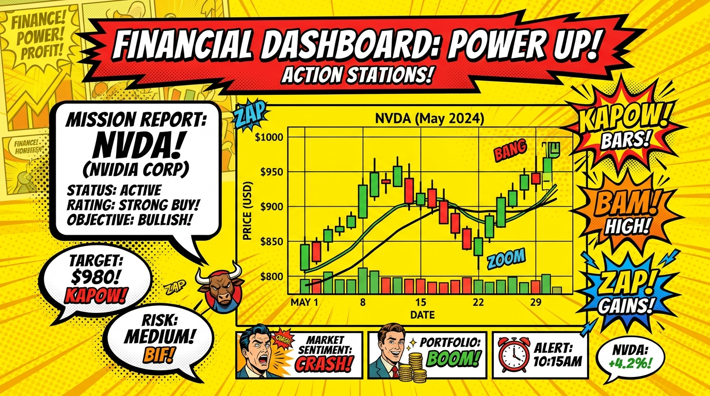
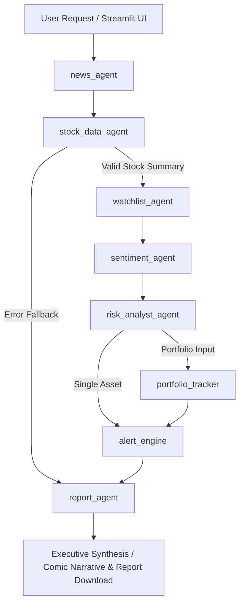

# 💥 MarketPulse AI — Worldwide Autonomous Multi-Agent Financial Intelligence Platform

[](https://www.python.org/)
[](https://github.com/langchain-ai/langgraph)
[](https://github.com/langchain-ai/langchain)
[](https://streamlit.io/)
[](https://docs.pytest.org/)

**MarketPulse AI** is a world-class, production-grade financial intelligence engine powered by a **7-Agent LangGraph StateGraph pipeline**. It orchestrates autonomous AI agents to collect financial news, fetch real-time market quotes, perform per-article LLM sentiment scoring, analyze downside risk flags, compute Efficient Frontier portfolio weights, and deliver publication-grade investment reports in both **Claude Warm Dark Theme** and **Comic Pop-Art Graphic Novel UI**!

---

## 💥 Visual Themes & UI Previews

### 💥 Comic / Graphic Novel Financial Intelligence Mode


### 🧡 Main Dashboard (Claude Warm Dark Theme)


### 📊 Stock Screener & Asset Comparison Matrix


---

## ✨ Key Innovations & Features

- **🎨 Multi-Theme System (`ui/theme.py` & `ui/comic_theme.py`)**: Dynamic in-app toggle between **Claude Warm Dark** (`#181816` terracotta aesthetic) and **Comic Pop-Art Graphic Novel UI** (`#ffde59` vibrant yellow, speech bubble cards, and starburst action badges).
- **🤖 Autonomous 7-Agent Directed Graph**:
  - `news_agent`: Scrapes global news feeds via NewsAPI with keyword fallback.
  - `stock_data_agent`: Fetches real-time price quotes, market cap, PE ratio, and historical OHLC history via yfinance.
  - `watchlist_agent`: Tracks target price alerts, RSI overbought/oversold limits, and volume anomalies.
  - `sentiment_agent`: LLM-based per-article sentiment scoring (-1.0 to +1.0) and market consensus evaluation.
  - `risk_analyst_agent`: Synthesizes market volatility, beta, and news data into downside risk flags.
  - `portfolio_tracker`: Computes Sharpe ratios, concentration risk, and Efficient Frontier asset allocation.
  - `report_agent`: Generates executive Markdown investment intelligence reports.
- **⚡ Worldwide Production Optimizations**:
  - **In-Memory & Persistent Disk TTL Cache (`tools/disk_cache.py`)**: Reduces quote latency by up to 80%.
  - **Global World Market Index Scanner (`tools/world_market_scanner.py`)**: Monitors S&P 500, Nasdaq, FTSE 100, Nikkei 225, and Nifty 50 macro regimes.
  - **ESG Sustainability Scorer (`tools/esg_scorer.py`)**: Environmental, Social, and Governance corporate ratings.
  - **Dark Pool & Institutional Order Flow Tracker (`tools/dark_pool_tracker.py`)**: Detects off-exchange volume anomalies.
  - **Monte Carlo 10,000-Path Simulator (`tools/monte_carlo.py`)**: Stochastic Geometric Brownian Motion asset return distribution and VaR model.
  - **Security & Authorization Middleware (`config/security.py`, `config/auth.py`)**: Secret redaction and JWT header authorization.

---

## 🏛️ Multi-Agent Architecture



---

## 🚀 Quickstart Guide

### 1. Installation
```bash
git clone https://github.com/Sharan-G-S/Marketpulse-AI-Agents.git
cd marketpulse-ai-agents
pip install -r requirements.txt
```

### 2. Environment Variables
Create a `.env` file or export your API credentials:
```bash
export OPENAI_API_KEY="your-openai-api-key"
# or for Google Gemini:
export GOOGLE_API_KEY="your-google-api-key"
```

### 3. Launching the Multi-Theme Dashboard
```bash
streamlit run ui/app.py
```

### 4. Running the Multi-Agent CLI
```bash
python main.py --ticker AAPL --depth standard
```

---

## 🧪 Test Suite Verification

Run the full pytest suite across all 547+ unit and integration tests:
```bash
python -m pytest
```

---

## 📜 License

This project is licensed under the MIT License — see the [LICENSE](LICENSE) file for details.

*Disclaimer: MarketPulse AI is built strictly for educational and research purposes and does not constitute official financial advice.*
