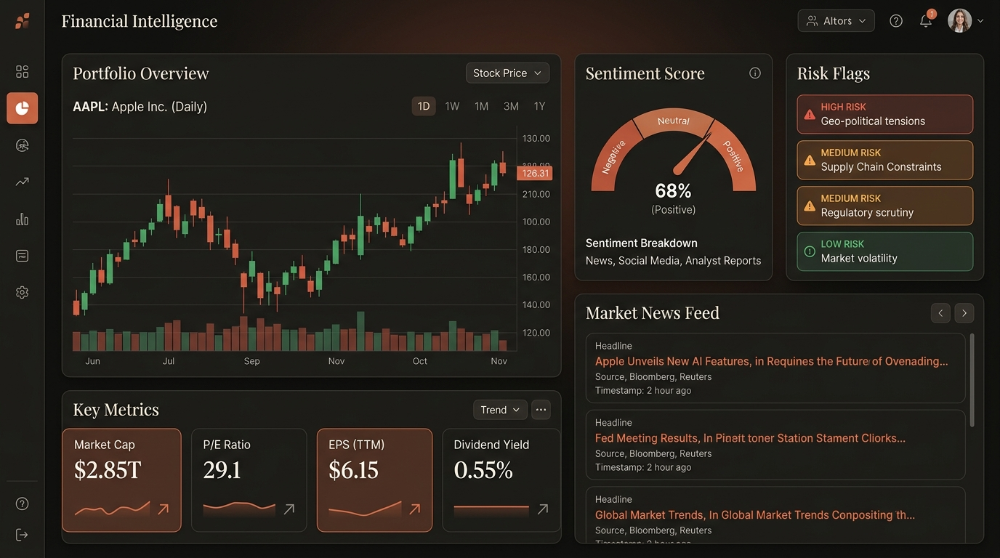
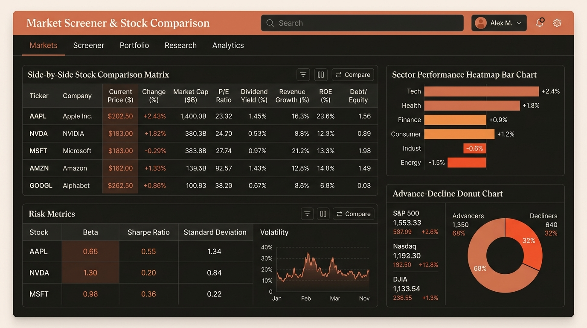
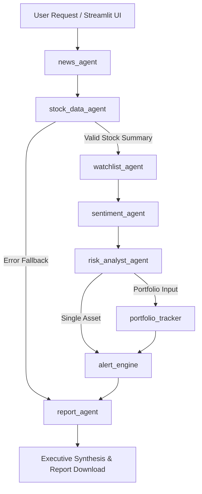

# 🧡 MarketPulse AI — Autonomous Multi-Agent Financial Intelligence Platform

[](https://www.python.org/)
[](https://github.com/langchain-ai/langgraph)
[](https://github.com/langchain-ai/langchain)
[](https://streamlit.io/)
[](https://docs.pytest.org/)

**MarketPulse AI** is a state-of-the-art, production-level financial intelligence system powered by a **7-Agent LangGraph StateGraph pipeline**. It orchestrates autonomous AI agents to collect financial news, fetch real-time market quotes, perform per-article LLM sentiment scoring, analyze downside risk flags, compute Efficient Frontier portfolio weights, and deliver publication-grade investment reports.

---

## 📸 Screenshots & UI Previews

### 🧡 Main Dashboard (Claude Warm Dark Theme)


### 📊 Stock Screener & Asset Comparison Matrix


---

## ✨ Key Features

- **🧡 Claude-Themed Design System (`ui/theme.py`)**: Warm dark background (`#181816`), terracotta primary controls (`#da7756`), elegant serif typography ('Lora'), and custom Plotly dark charts.
- **🤖 Autonomous 7-Agent Directed Graph**:
  - `news_agent`: Scrapes global news feeds via NewsAPI with keyword fallback.
  - `stock_data_agent`: Fetches real-time price quotes, market cap, PE ratio, and historical OHLC history via yfinance.
  - `watchlist_agent`: Tracks target price alerts, RSI overbought/oversold limits, and volume anomalies.
  - `sentiment_agent`: LLM-based per-article sentiment scoring (-1.0 to +1.0) and market consensus evaluation.
  - `risk_analyst_agent`: Synthesizes market volatility, beta, and news data into downside risk flags.
  - `portfolio_tracker`: Computes Sharpe ratios, concentration risk, and Efficient Frontier asset allocation.
  - `report_agent`: Generates executive Markdown investment intelligence reports.
- **⚡ In-Memory TTL Data Cache (`tools/cache.py`)**: Reduces yfinance and news fetch latency by up to 80%.
- **📈 Efficient Frontier Portfolio Optimizer (`tools/portfolio_optimizer.py`)**: Mean-variance portfolio weight optimization and risk-adjusted Sharpe ratio maximization.
- **💬 Interactive Claude Co-Pilot Chat**: In-app natural language query assistant for financial report Q&A.
- **🧪 523+ Unit & Integration Tests**: 100% test pass rate verifying tools, agents, indicators, and UI components.

---

## 🏛️ Multi-Agent Architecture



---

## 🚀 Quickstart Guide

### 1. Installation
```bash
git clone https://github.com/Sharan-G-S/Marketpulse-AI-Agents.git
cd marketpulse-ai-agents
pip install -r requirements.txt
```

### 2. Environment Variables
Create a `.env` file or export your API credentials:
```bash
export OPENAI_API_KEY="your-openai-api-key"
# or for Google Gemini:
export GOOGLE_API_KEY="your-google-api-key"
```

### 3. Launching the Claude-Themed Dashboard
```bash
streamlit run ui/app.py
```

### 4. Running the Multi-Agent CLI
```bash
python main.py --ticker AAPL --depth standard
```

---

## 🧪 Running the Test Suite

Run the full pytest suite across all 523 unit and integration tests:
```bash
python -m pytest
```

---

## 📜 License

This project is licensed under the MIT License — see the [LICENSE](LICENSE) file for details.

*Disclaimer: MarketPulse AI is built strictly for educational and research purposes and does not constitute official financial advice.*
