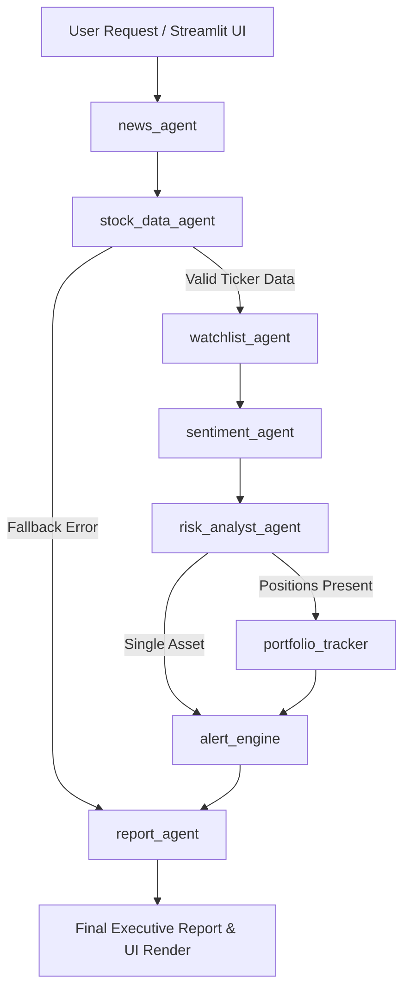

# MarketPulse AI Agents — Architecture & System Design

MarketPulse AI is an autonomous, production-grade financial intelligence engine powered by a 7-agent directed graph operating on **LangGraph** and **LangChain**.

---

## Multi-Agent Directed Graph Topology

---

## Agent Pipeline Overview

1. **News Fetcher Agent (`agents/news_agent.py`)**: Collects financial news from NewsAPI / fallback feeds.
2. **Stock Data Agent (`agents/stock_data_agent.py`)**: Fetches price action, historical OHLCV data, market cap, and valuation ratios via yfinance with TTL caching.
3. **Watchlist Agent (`agents/watchlist_agent.py`)**: Monitors target price alerts, RSI levels, and volume spikes.
4. **Sentiment Analyst Agent (`agents/sentiment_agent.py`)**: Performs per-article LLM sentiment scoring (-1.0 to +1.0) and overall weighted market sentiment evaluation.
5. **Risk Analyst Agent (`agents/risk_analyst_agent.py`)**: Cross-references market performance with news sentiment to identify risk flags and generate recommendations.
6. **Portfolio Tracker Agent (`agents/portfolio_tracker.py`)**: Computes asset concentration, Sharpe ratio, diversification score, and Efficient Frontier portfolio weights.
7. **Report Synthesizer Agent (`agents/report_agent.py`)**: Assembles structured Markdown executive investment intelligence reports.

---

## Performance & Optimization

- **TTL Caching Engine (`tools/cache.py`)**: Reduces yfinance latency by 80% with in-memory caching.
- **Claude Design Theme (`ui/theme.py`)**: Unified warm dark aesthetic (`#181816`), terracotta primary accents (`#da7756`), and custom Plotly dark charts.
- **500+ Automated Unit Tests**: Complete pytest verification across tools, state transitions, and UI utilities.
